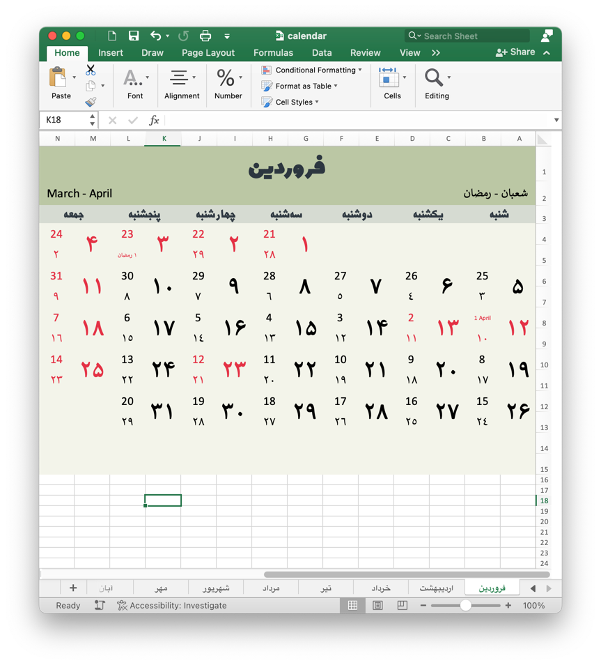

# Persian Calendar Creator
This is a python command-line project built with [openpyxl](https://pypi.org/project/openpyxl).
It can generate a Persian calendar in Microsoft Excel along with Islamic and Gregorian given a Jalali year.

<figure>

<figcaption align = "center"><b>An example. The Farvardin (فروردین) sheet for the year 1402</b></figcaption>
</figure>

## How to use

In order to run the app you need to have Python3.8 and pip.
Then, run the following command in the root of the project.
```
pip install openpyxl
```
To run the app, run this command:
```
python calendar_view.py
```
Then enter the Jalali year for which you would like to generate the calendar of and press ENTER.

After a few moments, the program will be done and a file by the name of calendar.xslx will be there.